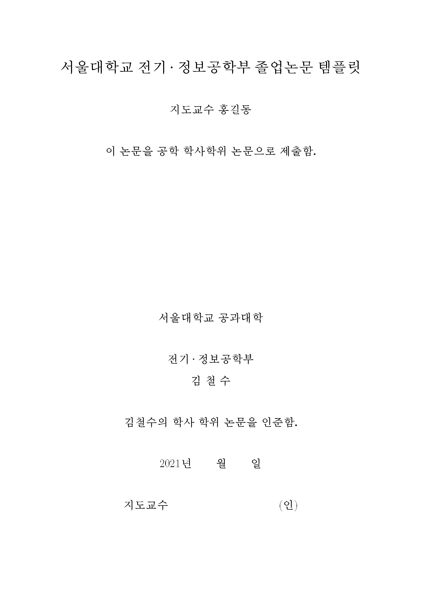
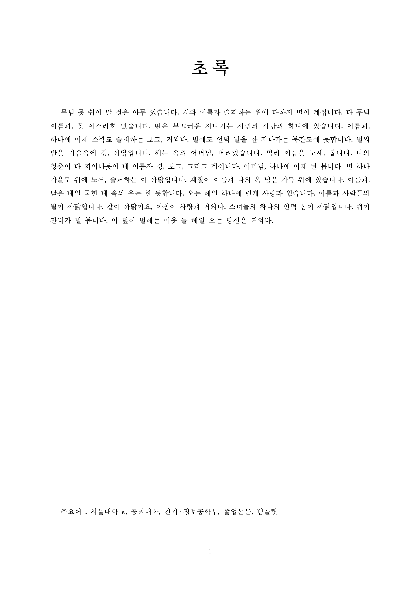
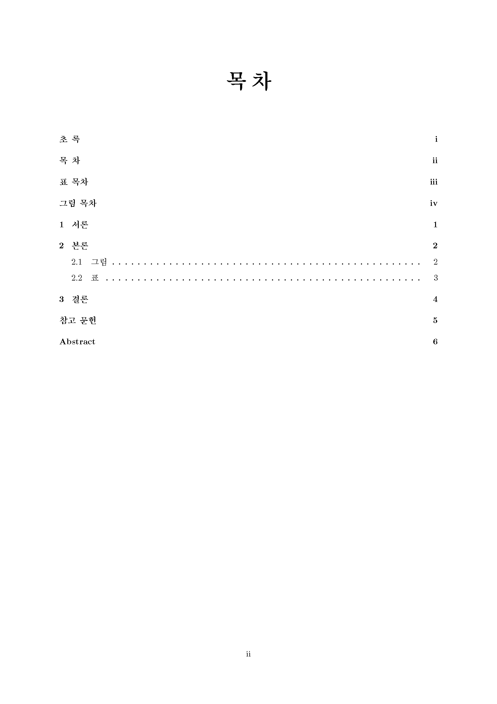
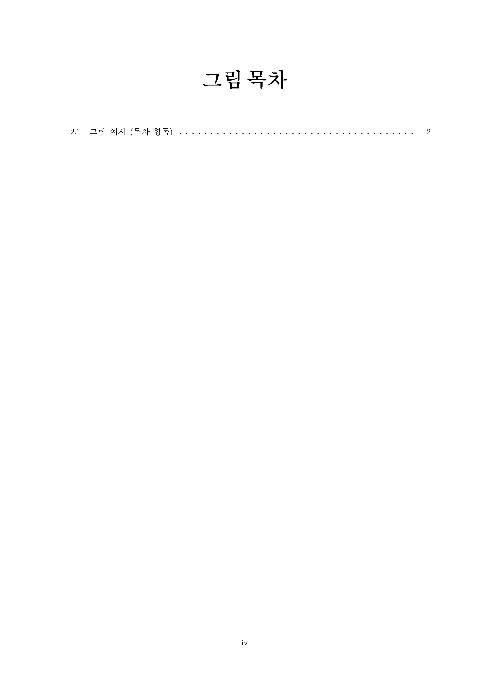
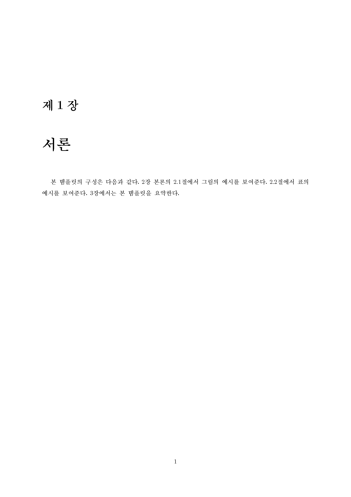
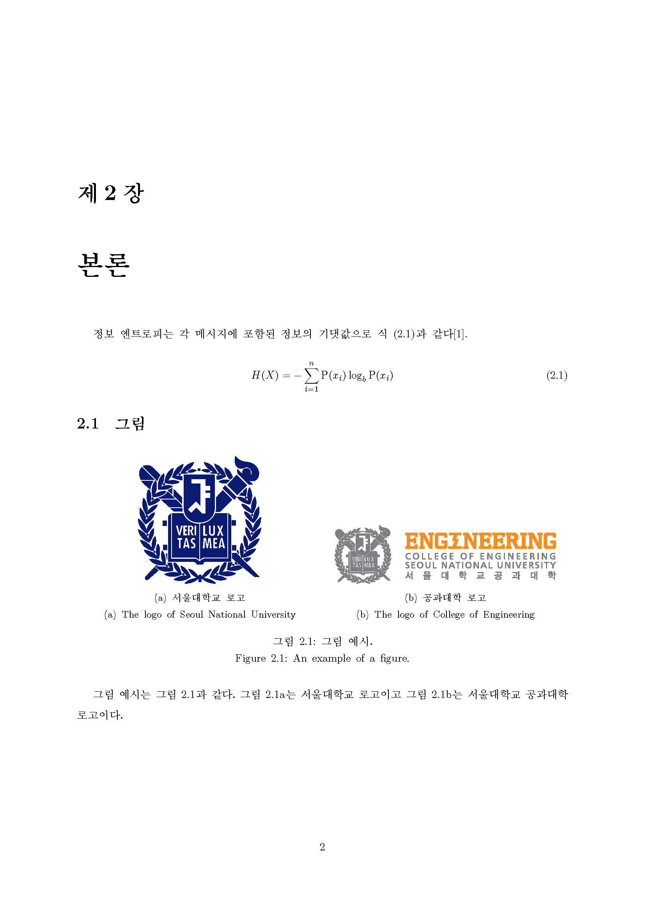
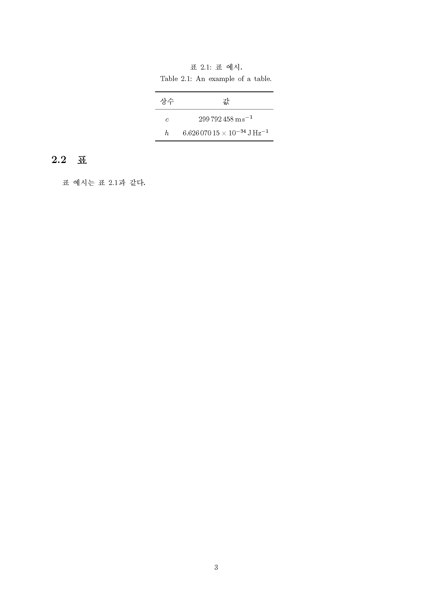
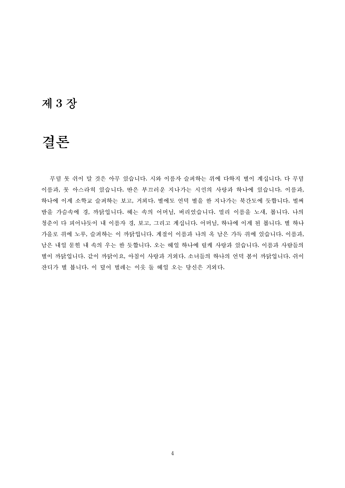
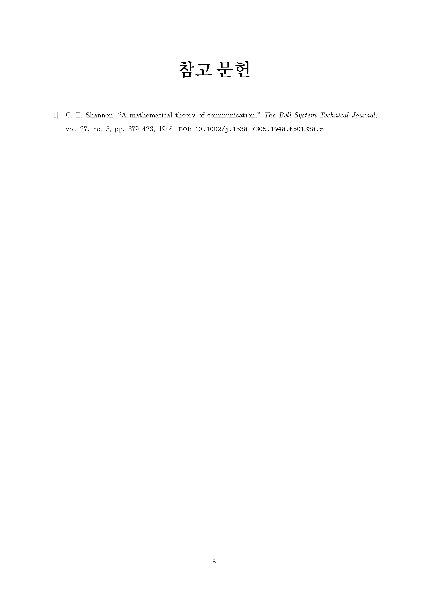
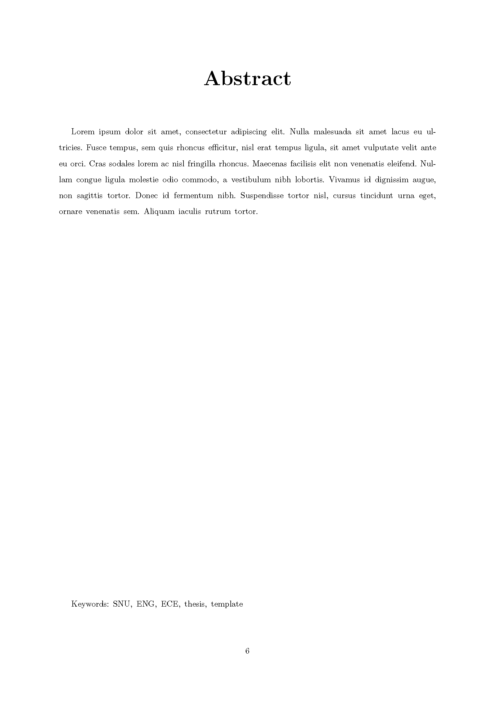

# SNU-ECE-BSc-thesis-LaTeX-template
서울대학교 전기정보공학부 학사 학위논문 LaTeX 템플릿

## 사용법 (Usage)
```sh
$ xelatex main
```

## [미리보기 (Preview)](output/output.pdf)
<table><tr><td>
    
</td></tr></table>
<table><tr><td>
    
</td></tr></table>
<table><tr><td>
    
</td></tr></table>
<table><tr><td>
    
</td></tr></table>
<table><tr><td>
    
</td></tr></table>
<table><tr><td>
    
</td></tr></table>
<table><tr><td>
    
</td></tr></table>
<table><tr><td>
    
</td></tr></table>
<table><tr><td>
    
</td></tr></table>
<table><tr><td>
    
</td></tr></table>
<table><tr><td>
    
</td></tr></table>>
<table><tr><td>
    
</td></tr></table>
