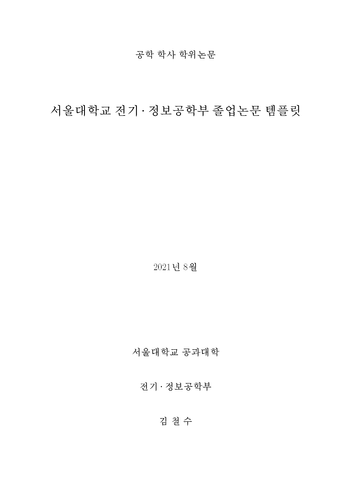
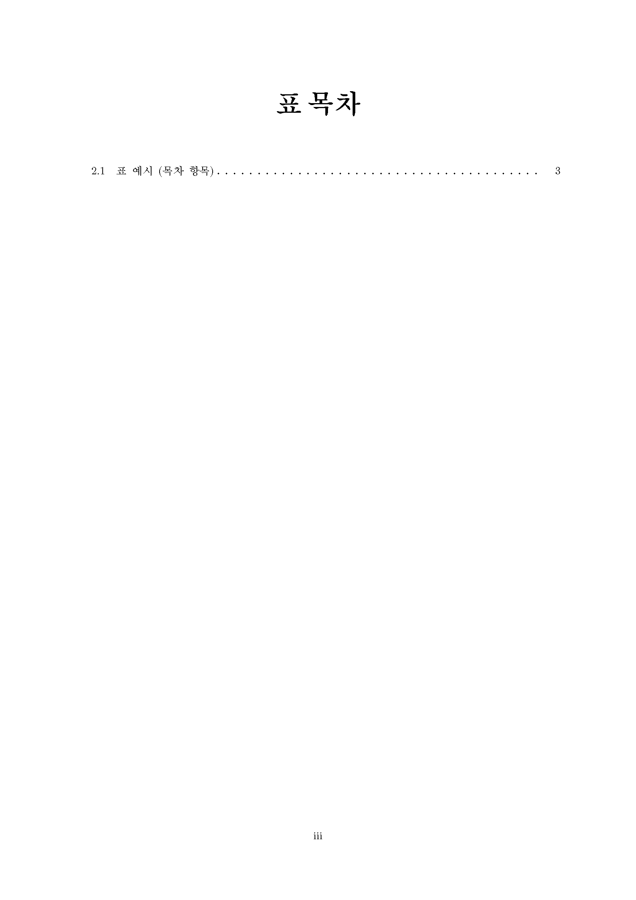

# SNU-ECE-BSc-thesis-LaTeX-template
서울대학교 전기·정보공학부 학사 학위논문 LaTeX (비공식) 템플릿

(키워드: 전기공학설계프로젝트, 졸업프로젝트, 졸업논문, 졸논)

## 사용법 (Usage)
XeLaTeX

## 참고
- **최신 학부졸업논문 작성지침:** [전기·정보공학부 학사 공지사항](http://ece.snu.ac.kr/community/notice/academic) 내 학부생 졸업신청 공지
- [jdj under_template](https://ssl.snu.ac.kr/~jdj/tex/)
- [석/박사 학위논문 LaTeX 양식(v1.1) + 학부 졸업논문용](https://ee.snu.ac.kr/intranet/bbs/free?bm=v&bbsidx=29068) (전기·정보공학부 인트라넷)
- [KTUG 서울대학교 졸업논문 스타일 모음](http://faq.ktug.org/faq/%c7%d0%c0%a7%b3%ed%b9%ae%bd%ba%c5%b8%c0%cf#s-1.2)
- [**zeta709/snuthesis**: SNU (EECS) UNOFFICIAL LaTeX template](https://github.com/zeta709/snuthesis)

## [미리보기 (Preview)](output/output.pdf)
<table><tr><td>
    
</td></tr></table>
<table><tr><td>
    
</td></tr></table>
<table><tr><td>
    
</td></tr></table>
<table><tr><td>
    
</td></tr></table>
<table><tr><td>
    
</td></tr></table>
<table><tr><td>
    
</td></tr></table>
<table><tr><td>
    
</td></tr></table>
<table><tr><td>
    
</td></tr></table>
<table><tr><td>
    
</td></tr></table>
<table><tr><td>
    
</td></tr></table>
<table><tr><td>
    
</td></tr></table>
<table><tr><td>
    
</td></tr></table>
